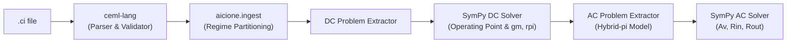

# AI.ciOne (`aicione`)

Analytical reasoning, symbolic equation formulation, and solving engine for analog electronic circuits.

## Overview

`AI.ciOne` is the computational companion to the [CEML](https://github.com/aicione/ceml-lang) circuit markup language. It ingests validated circuit specifications (`.ci`), decomposes them by physical regimes (DC quiescent bias vs AC small-signal), formulates modified nodal equations symbolically, and solves them deterministically using SymPy.

## Architecture & Pipeline



## Quick Start

```bash
# Activate virtual environment
source .venv/bin/activate

# Validate circuit using CEML
ceml check tests/fixtures/bjt_amplifier.ci

# Inspect extracted DC mathematical network
aicione inspect-dc tests/fixtures/bjt_amplifier.ci

# Solve DC operating point and hybrid-pi parameters
aicione solve-dc tests/fixtures/bjt_amplifier.ci

# Inspect extracted AC small-signal network
aicione inspect-ac tests/fixtures/bjt_amplifier.ci
```

## Architecture Decision Records (ADRs)

Design choices and implementation roadmaps are documented under [`decisions/`](decisions/README.md):

- [ADR 0001](decisions/0001-repository-architecture-and-ceml-integration.md): Repository Architecture and CEML-lang Integration
- [ADR 0002](decisions/0002-dc-solver-problem-extraction.md): DC Solver Problem Extraction and Mathematical Representation
- [ADR 0003](decisions/0003-dc-analytical-solver-sympy.md): DC Analytical Solver using SymPy Nodal Analysis and Device Models
- [ADR 0004](decisions/0004-ac-small-signal-solver-roadmap.md): AC Small-Signal Solver Strategy and Implementation Roadmap
- [ADR 0005](decisions/0005-ac-small-signal-hybrid-pi-ast.md): AC Small-Signal AST Modeling and Linearized Device Representations
- [ADR 0006](decisions/0006-ac-problem-extraction-and-node-coalescing.md): AC Circuit Problem Extraction and Node Coalescing
