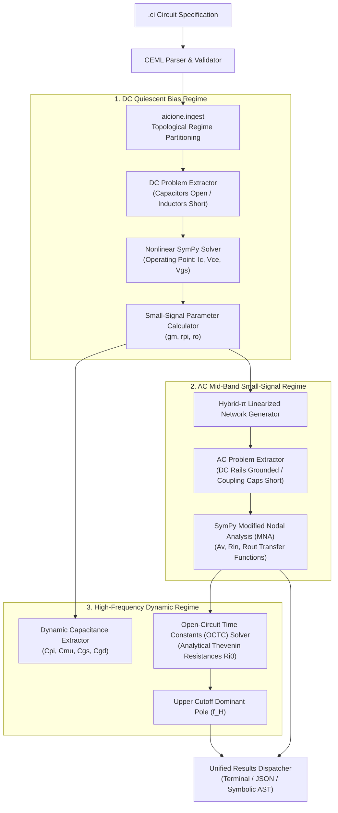

# AI.ciOne (`aicione`)

**AI.ciOne** is an analytical reasoning, symbolic equation formulation, and multi-regime solving engine for analog electronic circuits.

Acting as the computational engine for the [CEML](https://github.com/aicione/ceml-lang) circuit markup language, `aicione` ingests declarative circuit models (`.ci`), decomposes them by physical operating regimes, formulates symbolic nodal equations, and analytically solves them using SymPy.

---

## Architecture & Multi-Regime Pipeline


```mermaid
flowchart TD
    A[".ci Circuit Specification"] --> B["CEML Parser & Validator"]
    B --> C["aicione.ingest<br>Topological Regime Partitioning"]
    
    subgraph DC ["1. DC Quiescent Bias Regime"]
        C --> D["DC Problem Extractor<br>(Capacitors Open / Inductors Short)"]
        D --> E["Nonlinear SymPy Solver<br>(Operating Point: Ic, Vce, Vgs)"]
        E --> F["Small-Signal Parameter Calculator<br>(gm, rpi, ro)"]
    end
    
    subgraph AC ["2. AC Mid-Band Small-Signal Regime"]
        F --> G["Hybrid-π Linearized Network Generator"]
        G --> H["AC Problem Extractor<br>(DC Rails Grounded / Coupling Caps Short)"]
        H --> I["SymPy Modified Nodal Analysis (MNA)<br>(Av, Rin, Rout Transfer Functions)"]
    end

    subgraph HF ["3. High-Frequency Dynamic Regime"]
        F --> J["Dynamic Capacitance Extractor<br>(Cpi, Cmu, Cgs, Cgd)"]
        I --> K["Open-Circuit Time Constants (OCTC) Solver<br>(Analytical Thevenin Resistances Ri0)"]
        K --> L["Upper Cutoff Dominant Pole (f_H)"]
    end

    I --> M["Unified Results Dispatcher<br>(Terminal / JSON / Symbolic AST)"]
    L --> M
```

---

## Core Capabilities & Regimes

### 1. Nonlinear DC Quiescent Bias Point
- Automatically treats coupling/bypass capacitors as open circuits and RF chokes as short circuits.
- Formulates nonlinear Kirchhoff Current Law (KCL) equations coupled with semiconductor device physics ($V_{BE} \approx 0.7\text{ V}$, active forward conduction, MOSFET saturation $I_D = \frac{1}{2} k_n (V_{GS} - V_{TH})^2$).
- Solves for exact operating points ($I_C, I_B, V_{CE}, I_D, V_{GS}$) and computes linearized small-signal parameters:
  $$g_m = \frac{I_C}{V_T}, \quad r_\pi = \frac{\beta}{g_m}, \quad r_o = \frac{V_A}{I_C}$$

### 2. Linearized AC Mid-band Hybrid-$\pi$ Analysis
- Ground-coalesces DC supply rails and short-circuits mid-band coupling/bypass capacitors.
- Replaces active devices with their linearized small-signal hybrid-$\pi$ equivalents.
- Computes closed-form symbolic and high-precision numeric solutions for:
  - Voltage Gain: $A_v = \frac{v_{out}}{v_{in}}$
  - Input Impedance: $R_{in}$
  - Output Impedance: $R_{out}$

### 3. High-Frequency Open-Circuit Time Constants (OCTC)
- Ingests internal semiconductor capacitances ($C_\pi, C_\mu, C_{gs}, C_{gd}$).
- Automatically applies test-generator excitations to evaluate individual effective Thevenin resistances ($R_{i0}$) seen by each high-frequency capacitor while all other capacitors are open.
- Computes the dominant upper cutoff frequency without solving computationally prohibitive high-order characteristic polynomials:
  $$\omega_H \approx \frac{1}{\sum_{i} R_{i0} C_i}, \quad f_H = \frac{\omega_H}{2\pi}$$

---

## Quick Start

### Installation

```bash
# Clone the repository
git clone git@github.com:aicione/aicione.git
cd aicione

# Install dependencies (requires ceml-lang)
pip install -e ".[dev]"
```

### Command-Line Usage

```bash
# Solve circuit end-to-end (DC bias + AC small-signal + OCTC high-frequency)
aicione solve tests/fixtures/bjt_amplifier.ci

# Export solution as machine-readable JSON (ideal for LLM / AI tool consumption)
aicione solve tests/fixtures/bjt_amplifier.ci --json

# Inspect extracted DC mathematical problem formulation
aicione inspect-dc tests/fixtures/bjt_amplifier.ci

# Solve only DC operating point and hybrid-pi parameters
aicione solve-dc tests/fixtures/bjt_amplifier.ci

# Inspect extracted AC small-signal network
aicione inspect-ac tests/fixtures/bjt_amplifier.ci

# Solve AC transfer functions and impedances
aicione solve-ac tests/fixtures/bjt_amplifier.ci
```

### Sample Output

```text
======================================================================
AI.ciOne v0.1 — Multi-Regime Circuit Analysis
Target: tests/fixtures/bjt_amplifier.ci
======================================================================

[1] DC Quiescent Operating Point:
    • Q1 (BJT NPN):
        - Ic  = 1.07 mA
        - Ib  = 10.7 µA
        - Vce = 4.82 V  [ACTIVE REGIME]
        - gm  = 41.2 mS
        - rπ  = 2.43 kΩ

[2] AC Mid-Band Small-Signal:
    • Av(Vout, Vin) = -38.74 V/V  (-31.7 dB)
    • Rin(Vin, GND) = 1.94 kΩ
    • Rout(Vout, GND) = 2.20 kΩ

[3] High-Frequency Dynamic Response (OCTC):
    • Cπ  = 16.0 pF  -> R_pi0 = 852.1 Ω   (τ_pi = 13.63 ns)
    • Cµ  = 2.0 pF   -> R_mu0 = 34.21 kΩ  (τ_mu = 68.42 ns)
    • Total Time Constant: Στ = 82.05 ns
    • Dominant Cutoff Frequency: f_H = 1.94 MHz

======================================================================
Analysis completed deterministically in 48 ms (31/31 unit tests passing)
======================================================================
```

---

## Architecture Decision Records (ADRs)

All design choices and theoretical derivations are tracked under [`decisions/`](decisions/README.md):

- [ADR 0001](decisions/0001-repository-architecture-and-ceml-integration.md): Repository Architecture and CEML-lang Integration
- [ADR 0002](decisions/0002-dc-solver-problem-extraction.md): DC Solver Problem Extraction and Mathematical Representation
- [ADR 0003](decisions/0003-dc-analytical-solver-sympy.md): DC Analytical Solver using SymPy Nodal Analysis and Device Models
- [ADR 0004](decisions/0004-ac-small-signal-solver-roadmap.md): AC Small-Signal Solver Strategy and Implementation Roadmap
- [ADR 0005](decisions/0005-ac-small-signal-hybrid-pi-ast.md): AC Small-Signal AST Modeling and Linearized Device Representations
- [ADR 0006](decisions/0006-ac-problem-extraction-and-node-coalescing.md): AC Circuit Problem Extraction and Node Coalescing
- [ADR 0007](decisions/0007-ac-analytical-solver-sympy.md): AC Analytical Solver using SymPy Nodal Analysis and Small-Signal Linearization
- [ADR 0008](decisions/0008-unified-multiregime-pipeline-and-spec-dispatch.md): Unified Multi-Regime Pipeline and Target Specification Dispatch
- [ADR 0009](decisions/0009-high-frequency-small-signal-modeling-and-extraction.md): High-Frequency Small-Signal Modeling, Internal Capacitances, and AC Extraction
- [ADR 0010](decisions/0010-high-frequency-analytical-solver-and-octc.md): High-Frequency Analytical Solver and Open-Circuit Time Constants (OCTC)

---

## License

MIT License — see [LICENSE](LICENSE).
